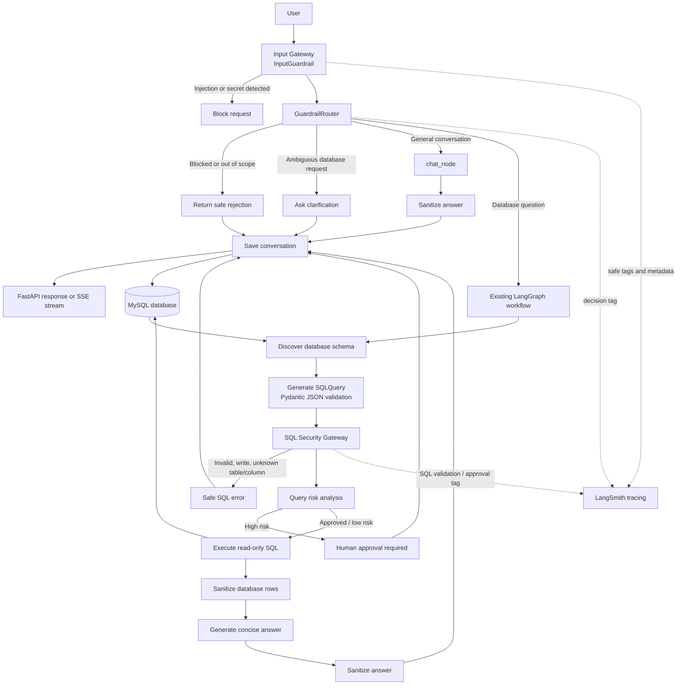

# Text-to-SQL Agent Workflow

The application keeps the existing LangGraph Text-to-SQL workflow and places the guardrail/router layer in front of it.

## Request routes

| Decision | Route | Result |
|---|---|---|
| Prompt injection, credentials, secrets, dangerous request | Blocked | Safe rejection before the LLM |
| Ambiguous database request | Clarification | User is asked for more context |
| General conversation | `chat_node` | LLM answer without schema or database credentials |
| Database question | Existing LangGraph | Schema discovery, SQL generation, validation, risk analysis, execution, answer |

## Security boundaries

- `DATABASE_URL`, API keys, tokens, passwords, and environment variables are never included in LLM prompts.
- User secrets are redacted before persistence or LLM invocation.
- Generated SQL must be a single read-only query.
- Tables and columns are checked against discovered schema.
- Risky queries can require approval before execution.
- Database rows and generated answers are sanitized before returning to the user.
- LangSmith metadata contains only safe identifiers and categorical decisions, never raw secrets.

## Current storage

- MySQL stores conversations, profile data, and discovered application data.
- With MySQL, LangGraph uses the in-memory checkpoint saver because the installed PostgreSQL checkpoint saver is PostgreSQL-specific.
- PostgreSQL deployments can use the existing PostgreSQL checkpoint path.
